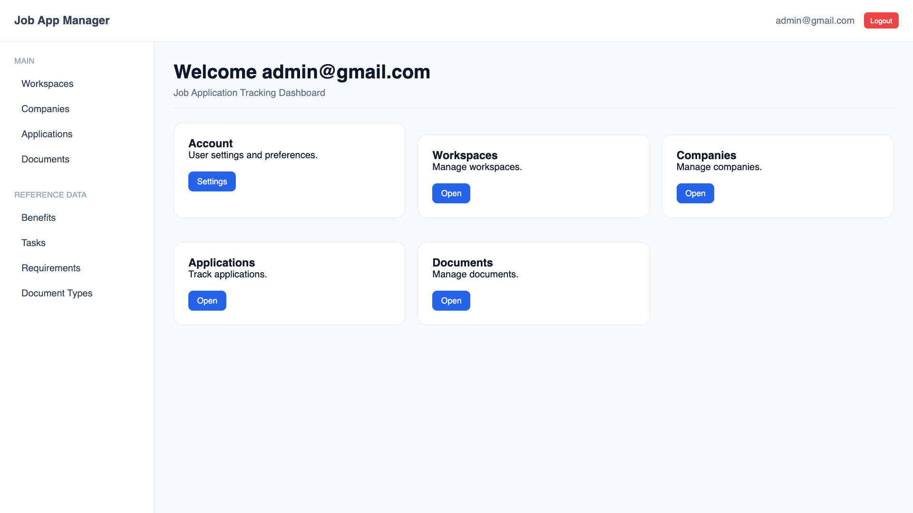
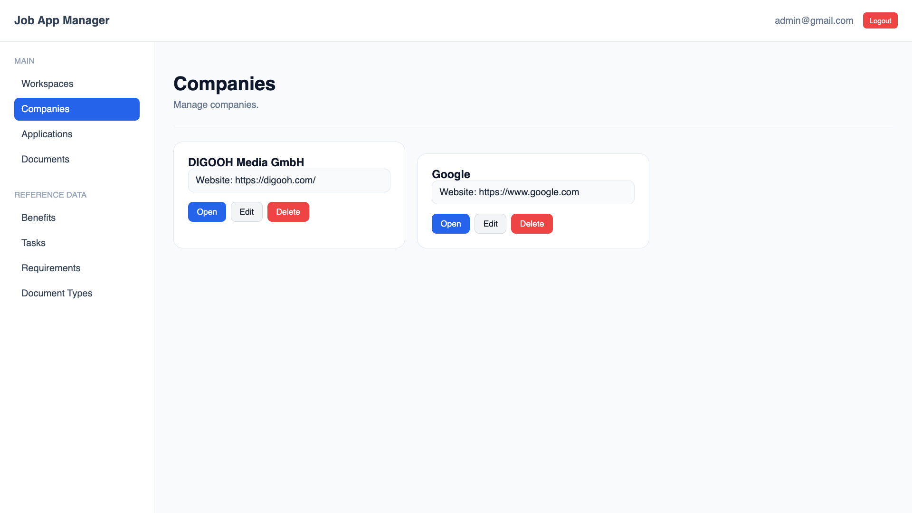
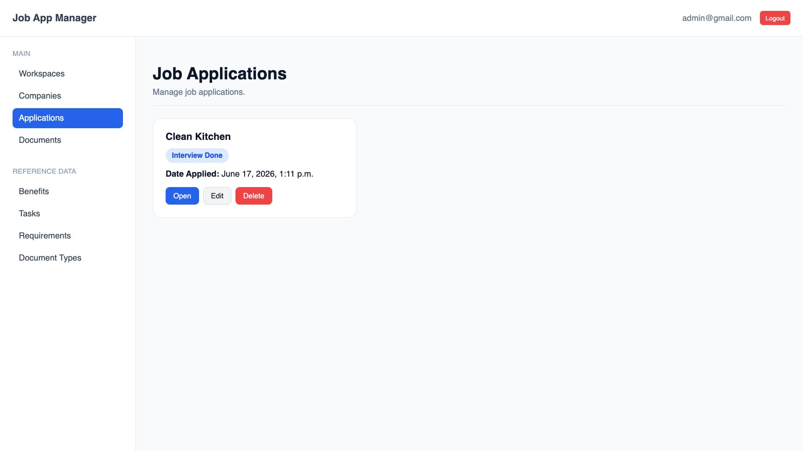
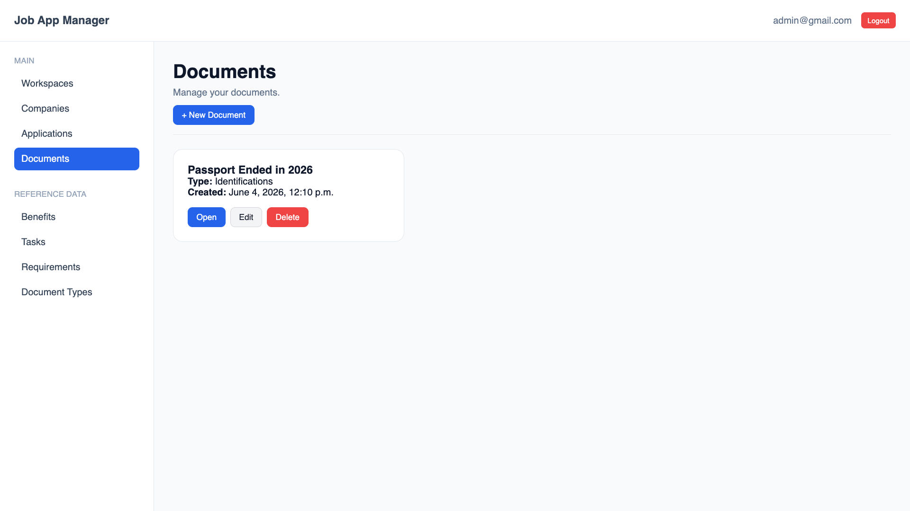

# Job Application Tracker

A Django-based platform for managing job search activities across multiple workspaces.

The project was designed to support both server-rendered web views and REST API endpoints while maintaining a shared domain layer through dedicated service and selector patterns.

## Features

- User authentication and authorization
- Workspace-based organization
- Company management
- Job position tracking
- Job application tracking
- Document management
- Company contact management
- Notes and application history
- REST API support
- Automated testing

## Architecture Highlights

This project intentionally avoids placing business logic inside views, serializers, or forms.

Instead, it follows a layered architecture:

```text
HTTP Request
      │
      ▼
 View / API
      │
      ▼
 Service Layer
      │
      ▼
    Models
```

Read operations are separated into dedicated selectors:

```text
HTTP Request
      │
      ▼
 View / API
      │
      ▼
   Selector
      │
      ▼
   Database
```

### Architectural Goals

- Centralize business logic
- Avoid duplicated validation
- Share domain logic between Web and API interfaces
- Improve maintainability
- Improve testability
- Enforce ownership boundaries consistently

### Security and Ownership

The application enforces ownership boundaries throughout the domain.

Authenticated users can only access resources that belong to their workspaces.

Ownership validation is enforced through selectors and services, ensuring consistent authorization behavior across both web views and REST API endpoints.

## Architectural Decisions

### Why Services?

Business rules are centralized in services so that
both Django views and DRF endpoints share the same
domain logic.

### Why Selectors?

Selectors isolate query logic and prevent
database access patterns from being duplicated
across the application.

### Why Workspaces?

Workspaces provide ownership boundaries,
organizational separation, and future scalability.

## Authentication

The application supports authenticated access through Django's authentication system for web views and JWT system for REST API.

### Web Application

Users authenticate through the standard login flow provided by Django authentication.

Authenticated users gain access only to resources they own.

Visit `accounts/signup/` through browser to create an account.

### REST API

The REST API currently uses JWT system.

API endpoints require an authenticated user and enforce ownership validation through the service and selector layers.

### Authorization

Authentication alone is not sufficient for access.

Ownership validation is performed throughout the application to ensure users can only access resources belonging to their own workspaces.

## Technology Stack

- Python
- Django
- Django REST Framework
- SQLite(Development) / PostgreSQL(Production)
- Pytest
- Coverage.py

## Project Structure

```text
apps/
├── accounts/
├── applications/
├── companies/
├── documents/
├── workspaces/
└── core/
```

### Layer Overview

#### Services

Services are responsible for:

- Create operations
- Update operations
- Delete operations
- Business validation
- Ownership validation
- Transaction management

#### Selectors

Selectors are responsible for:

- Read operations
- Filtering
- Ownership-aware queries
- Query reuse

### Workspace Ownership Model

The application is built around workspace isolation.

```text
User
│
└── Workspace
    │
    └── Company
        │
        └── Job Position
            │
            └── Job Application
```

This structure provides:

- Data isolation
- Organizational separation
- Consistent permission boundaries
- Future scalability opportunities

## Testing

The project contains:

- 581 automated tests
- 94% code coverage

Coverage includes:

- Models
- Services
- Selectors
- Serializers
- REST API endpoints
- Business validation logic

The service and selector layers are intentionally designed to support isolated and maintainable testing.

## Documentation

Additional documentation is available in the `docs/` directory:

- Architecture
- Domain Model
- Testing Strategy
- API Documentation
- Roadmap
- Setup

## Future Improvements

Planned improvements include:

- Enhanced filtering and search
- Improved error handling
- REST API Version 2
- Reporting and analytics
- Additional workspace features

## Learning Goals

This project was built as part of a continuous effort to learn:

- Django
- Django REST Framework
- Software architecture
- Automated testing
- API design
- Maintainable backend development

While the project began as a learning exercise, it has evolved into a production-oriented codebase focused on architectural consistency, testability, and long-term maintainability.

## Screenshots

### Dashboard



### Companies



### Applications



### Documents

