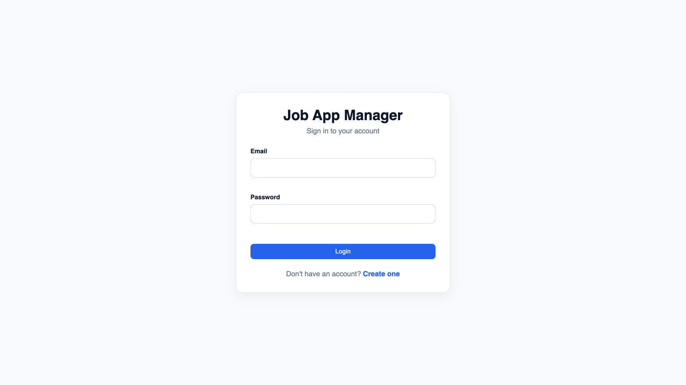
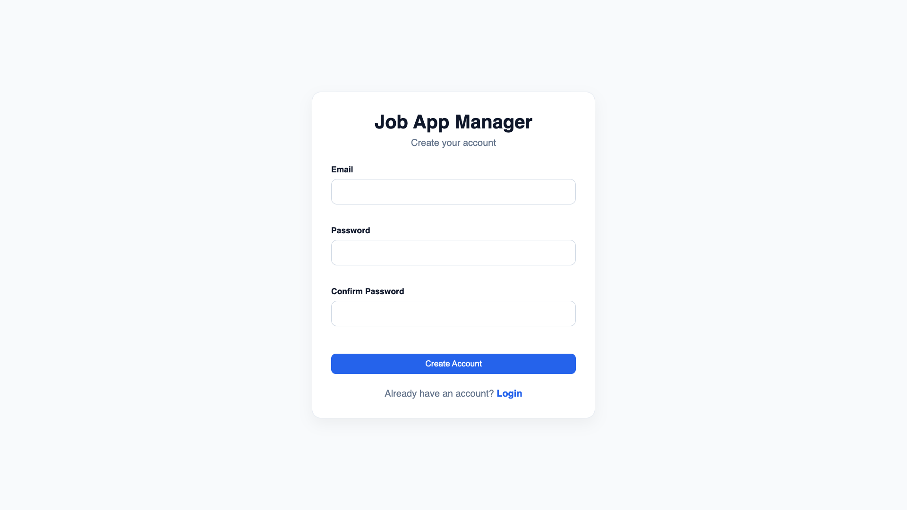
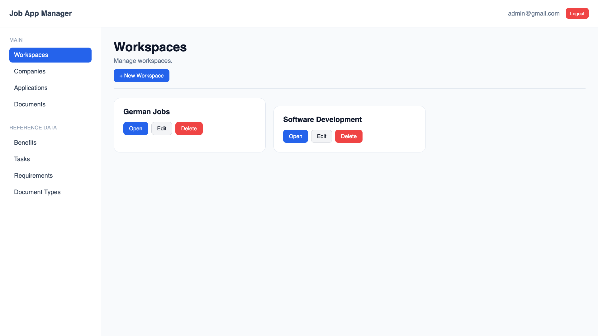
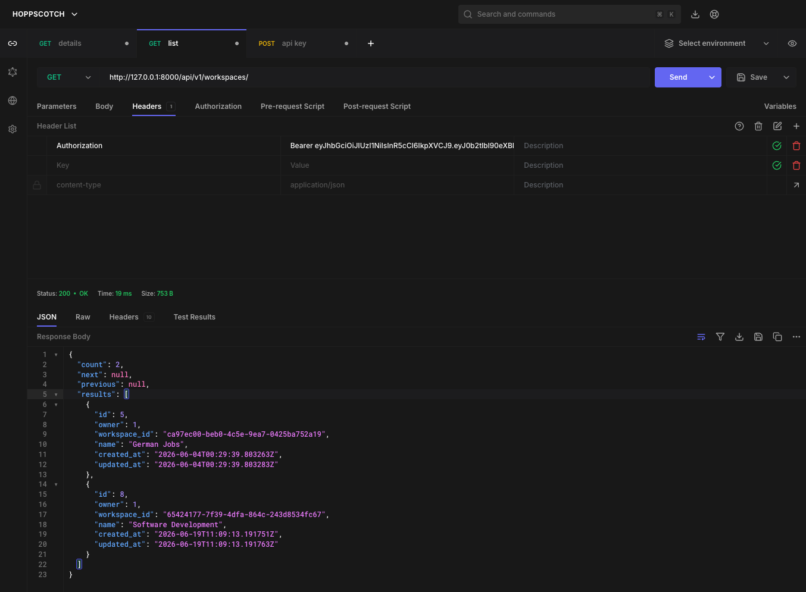
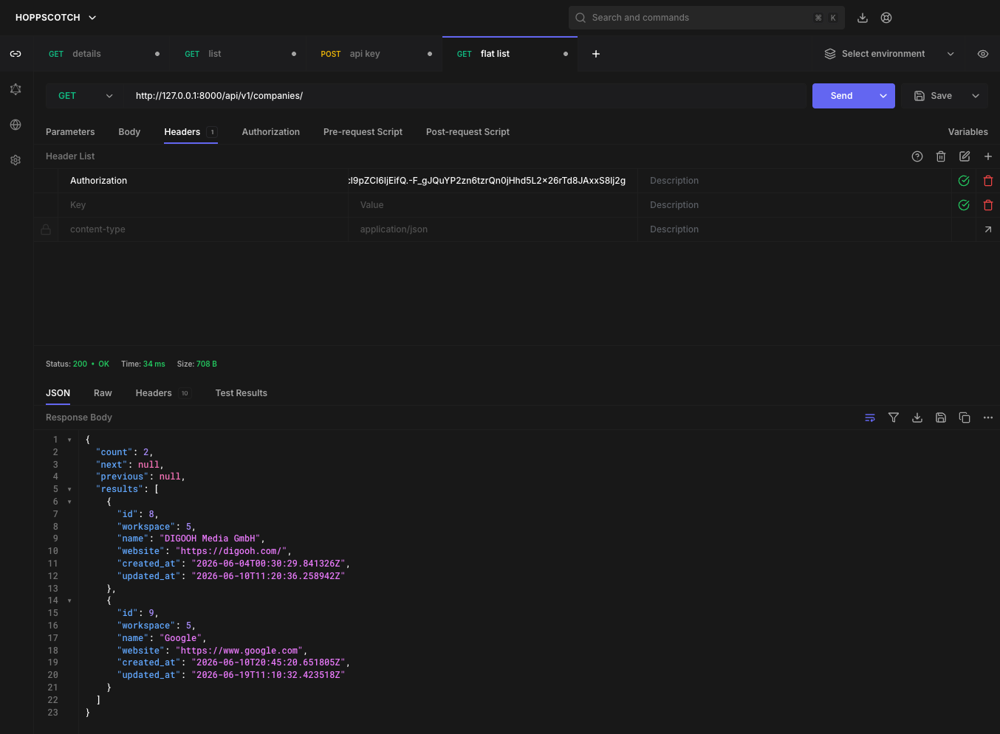
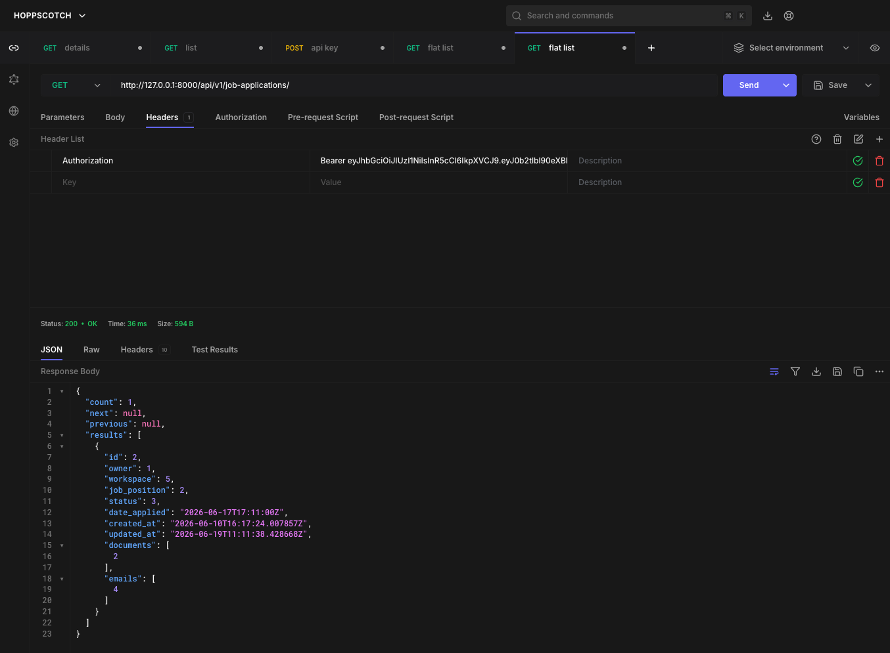

# Job Application Manager

A Django-based application for organizing and managing job-search activities.

The project supports both server-rendered web views and a REST API while sharing a common Application Layer built around **Services** and **Selectors**.

The project began as a learning project and evolved into a structured backend application focused on separation of concerns, domain ownership, testability, and maintainability.

---

## Features

- User authentication.
- Workspace-based organization.
- Company management.
- Job-position management.
- Job-application tracking.
- Application statuses and notes.
- Company contacts and notes.
- Job requirements, tasks, and benefits.
- Document and document-type management.
- Server-rendered Django views.
- Django REST Framework API.
- JWT authentication for the REST API.
- Automated testing.
- Ownership-aware data access.

---

## Architecture

The application follows a layered architecture.

```text
Presentation Layer
    │
    ├── Django Views
    ├── Forms
    ├── DRF ViewSets
    └── Serializers
    │
    ▼
Application Layer
    │
    ├── Selectors ── reads
    └── Services  ── writes
    │
    ▼
Persistence Layer
    │
    ├── Django Models
    └── Database
```

### Selectors

Selectors own read operations.

They are responsible for:

- Resource retrieval.
- Ownership-aware access.
- Filtering.
- Reusable query logic.
- Query optimization where appropriate.

### Services

Services own write operations and domain behavior.

They are responsible for:

- Create operations.
- Update operations.
- Delete operations.
- Business rules.
- Ownership validation.
- Domain invariants.
- Transaction boundaries.
- Persistence coordination.

### Presentation Layer

Views and API ViewSets coordinate requests and responses.

Forms and Serializers handle transport-specific validation and representation.

The Presentation Layer should not become a second implementation of domain logic.

---

## Ownership Model

The main ownership hierarchy is:

```text
User
│
└── Workspace
    │
    └── Company
        │
        └── Job Position
            │
            └── Job Application
```

Other resources, including Documents, Document Types, Job Requirements, Job Tasks, and Job Benefits, are user-owned according to the domain model.

Read access is enforced through ownership-aware Selectors.

Write operations are protected by Services.

A resource outside the caller's accessible ownership boundary is normally represented as **not found**, avoiding disclosure of another user's resource.

---

## Domain Invariants

The project distinguishes between direct resource access and invalid domain composition.

For example, Job Requirements, Job Tasks, and Job Benefits are user-owned reusable resources.

If a user directly requests another user's requirement:

```text
Selector
   ↓
Resource not found
   ↓
HTTP 404
```

If an invalid requirement object reaches a Job Position write operation:

```text
Service
   ↓
Ownership/domain invariant check
   ↓
DomainInvariantViolationError
   ↓
HTTP 400
```

This distinction exists because the second case is not merely a resource lookup. It is validation of a domain invariant during a write operation.

---

## Error Handling

The application uses a small set of application-level exception categories.

| Exception | Meaning | Presentation |
|---|---|---|
| `ResourceNotFoundError` | Requested resource is outside the accessible/readable scope | HTTP 404 |
| `BusinessRuleViolationError` | User operation violates an explicit business rule | HTTP 400 |
| `DomainInvariantViolationError` | Application reaches invalid domain state | HTTP 400 |
| `InfrastructureViolationError` | Infrastructure or unexpected implementation failure | HTTP 500 |

The application intentionally does not use a separate `AccessDeniedError`.

Internal exception details are not exposed to end users or API clients.

---

## Authentication

### Web Application

The web application uses Django's authentication system.

Users can register through the application's signup flow and authenticate through the normal login flow.

### REST API

The REST API uses JWT authentication through Django REST Framework Simple JWT.

Authentication endpoints:

```text
POST /api/v1/auth/
POST /api/v1/auth/refresh/
```

Authenticated API requests use:

```text
Authorization: Bearer <access-token>
```

See `docs/rest_api.md` for the API documentation.

---

## REST API

The API is versioned under:

```text
/api/v1/
```

Version 1 provides both flat resources and nested resource paths.

Examples:

```text
/api/v1/workspaces/
/api/v1/companies/
/api/v1/job-positions/
/api/v1/job-applications/
/api/v1/documents/
```

Nested resources include workspace/company/job-position/application relationships where the parent context is useful.

The API shares the same Services and Selectors as the web application.

---

## Testing

The project uses pytest and pytest-django.

Tests are organized around architectural responsibilities:

- Models.
- Services.
- Selectors.
- Forms.
- Serializers.
- Django Views.
- DRF ViewSets and API behavior.
- Exception handling.

The project deliberately does not advertise a fixed test count or coverage percentage because both change as the codebase evolves.

Run the full suite:

```bash
pytest
```

Run with coverage:

```bash
pytest --cov=apps --cov-report=term-missing
```

Test quality is evaluated by whether tests verify meaningful documented behavior, not by test count alone.

---

## Project Structure

```text
apps/
├── accounts/
├── applications/
├── companies/
├── core/
├── documents/
├── testing/
└── workspaces/

config/
├── api/
└── ...

docs/
├── architecture.md
├── architecture_layer_contracts/
├── domain.md
├── exceptions.md
├── rest_api.md
├── roadmap.md
├── setup.md
└── testing.md

templates/
static/
media/
requirements/
```

---

## Documentation

The `docs/` directory contains the project's architectural and operational documentation.

### Architecture

`docs/architecture.md`

High-level architectural structure and responsibilities.

### Architecture Contracts

`docs/architecture_layer_contracts/`

Detailed contracts for:

- Models.
- Query Filters.
- Selectors.
- Services.
- Presentation Layer.
- Presentation Layer checklist.

These contracts define the intended boundaries that implementation and tests should satisfy.

### Domain

`docs/domain.md`

Domain entities, relationships, ownership, and domain invariants.

### REST API

`docs/rest_api.md`

API authentication, URL structure, ownership behavior, pagination, filtering, and exception handling.

### Testing

`docs/testing.md`

Testing responsibilities and quality principles.

### Setup

`docs/setup.md`

Local development and environment setup.

### Roadmap

`docs/roadmap.md`

Future development ideas and infrastructure improvements.

---

## Technology Stack

- Python
- Django
- Django REST Framework
- Django REST Framework Simple JWT
- django-filter
- SQLite for the current default local configuration
- PostgreSQL driver support for production deployment configuration
- pytest
- pytest-django
- pytest-cov

---

## Screenshots

### Web Application

#### Login



#### Signup



#### Dashboard


#### Workspaces



#### Companies


#### Applications


#### Documents


### REST API

#### Workspaces



#### Companies



#### Applications



---

## Project Status

The project is intended to be a completed, production-oriented learning project rather than a claim of being production-deployed infrastructure.

The architecture, domain rules, exception semantics, and automated tests are documented so that the implementation can be audited against explicit contracts.

Before deployment to a real production environment, infrastructure and operational concerns such as database configuration, secret management, HTTPS, static/media storage, logging, monitoring, backups, and deployment automation must still be addressed.

---

## Learning Goals

This project was built to develop practical experience with:

- Django.
- Django REST Framework.
- Backend architecture.
- Domain modeling.
- Service and Selector patterns.
- API design.
- Automated testing.
- Ownership and data isolation.
- Maintainable software structure.

The project is intentionally documented as an engineering artifact: the goal is not only that the application works, but that its behavior and architectural decisions are explicit and testable.
